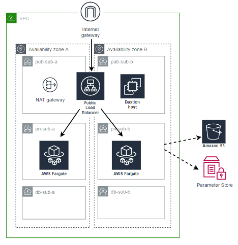

# terraform-fargate
Terraform code using AWS Fargate

This is the same output as the terraform-basic, only now using with Terraform Modules and AWS Fargate deployment.

Resources all on Tokyo region.

Write terraform VPC module that will create:

```
1 VPC
1 internet gateway associated to the VPC
1 NAT gateway, in the public subnet
2 public subnets (default route to internet gateway)
2 private subnet (default route to NAT gateway)
2 DB subnet (only local, no default route)
Write normal terraform code to create:
1 EC2 bastion on public subnet (ssh accessible to your IP only)
Write terraform ALB module that will create:
1 application load balancer, with 1 target group – port 80 (associated to 2 public subnets)
Write terraform ECS module that will create:
1 ECS Fargate cluster with 1 Service inside
Use any Docker container (like the previous assignment) and create a Fargate Task
The Fargate task is to be added on the ALB target group
1 IAM Role with S3ReadOnly and SSMFullAccess permissions for the Fargate cluster
**It is your choice if you want to include security group creation inside the modules or not.
```


